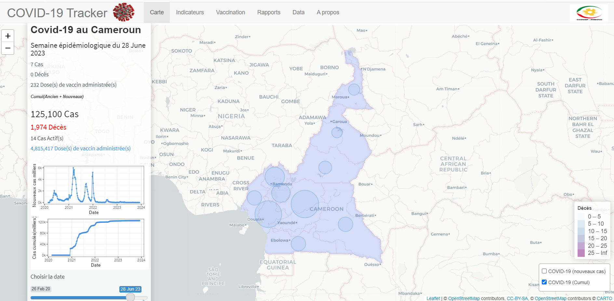
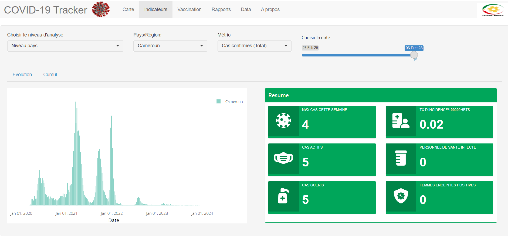
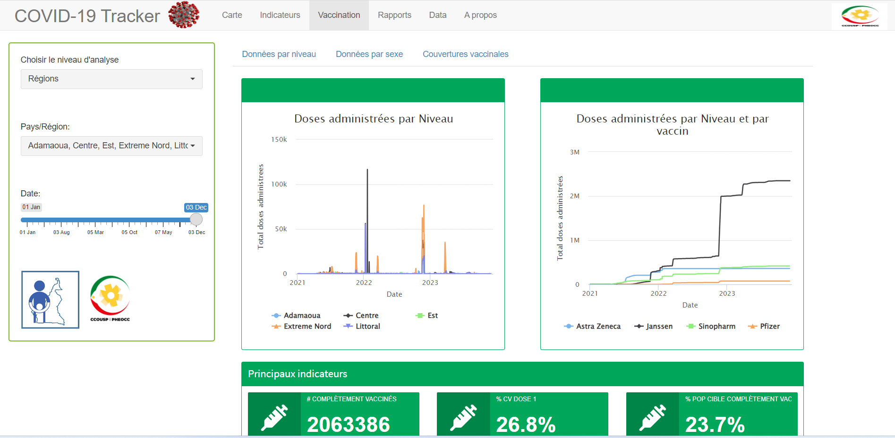
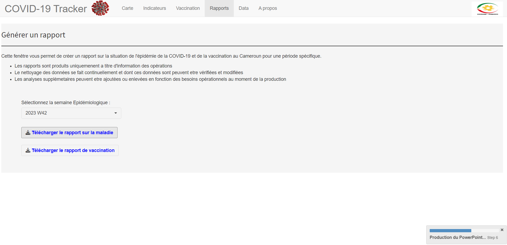
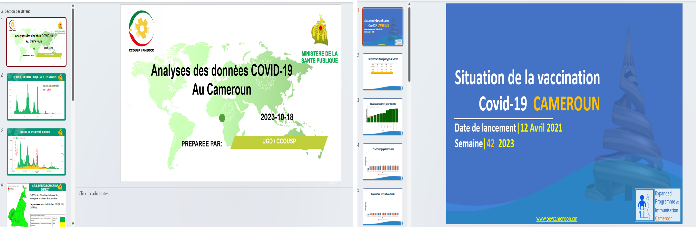

# CAMEROUN COVID-19 Tracker

Le **COVID-19 TRACKER** est un dashboard permettant de visualiser la situation de la COVID-19 au Cameroun, présentant des informations sur la maladie et la vaccination. Le dashboard comporte 5 principaux onglets.

## Onglet *Carte*

Cet onglet offre un aperçu de la situation de la COVID-19 pour une semaine épidémiologique choisie (cas, décès, vaccination). L'utilisateur peut sélectionner une semaine épidémiologique spécifique à l'aide du slicer. Les indicateurs sommaires sont affichés et représentés par régions, la taille des bulles étant proportionnelle au nombre de cas positifs pour une période spécifique.

## Onglet *Indicateurs*

Il présente les principaux indicateurs de la COVID-19 au Cameroun. L'utilisateur peut choisir le niveau d'analyse (national ou régional), la métrique d'analyse et la période d'analyse. L'évolution s'affichera ainsi que les principaux indicateurs. Il est également possible d'avoir la situation cumulée des indicateurs en cliquant sur "Cumul".

## Onglet *Vaccination*

Cet onglet présente les principaux indicateurs de la vaccination COVID-19 au Cameroun. Les données sont présentées par niveau, par sexe, avec la couverture vaccinale dose 1, la couverture vaccinale des personnes complètement vaccinées, la couverture vaccinale des personnes prioritaires, etc.

## Onglet *Rapport*

Cet onglet permet à l'utilisateur de générer un rapport PowerPoint. Les diapositives sont directement exploitables, similaires à ce qui est présenté lors des réunions de présentation hebdomadaire des données. L'utilisateur peut choisir une semaine épidémiologique spécifique et cliquer ensuite sur le bouton de téléchargement.

Ci-dessous, la sortie en image une fois le fichier PPTX téléchargé.

## Contact

Pour toute question ou commentaire, n'hésitez pas à me contacter à [an977\@georgetown.edu](mailto:an977@georgetown.edu){.email}.
